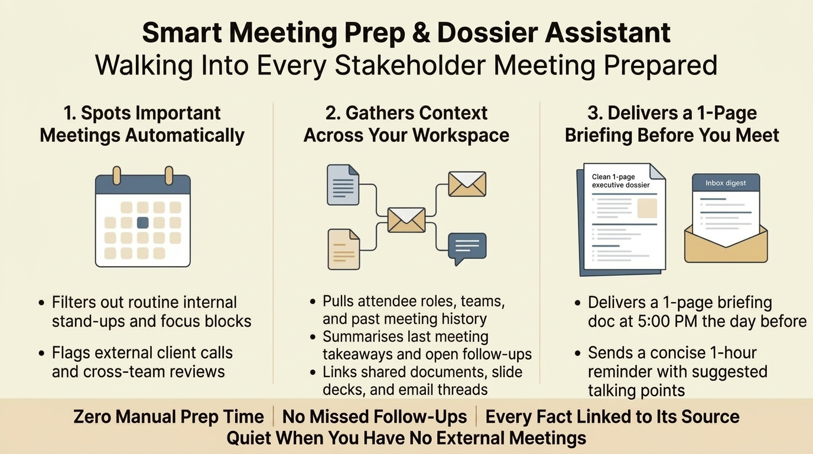
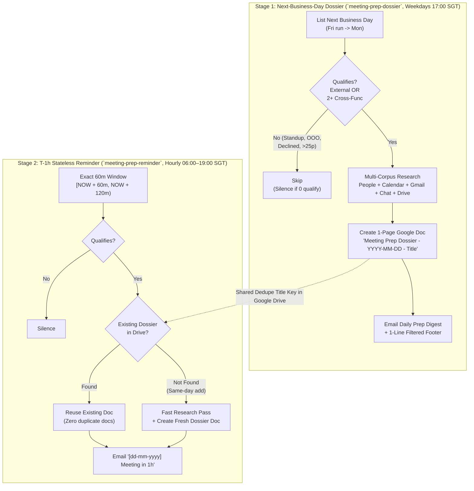

# Smart Meeting Prep & Dossier Generator

[](#)
[](#architecture--workflow)
[-3776AB?style=flat-square&logo=python&logoColor=white)](#mock-test-harness-5-scenarios--36-checks)
[](#observability-with-agent-tracer)



An autonomous, two-stage **Meeting Prep & Dossier Generator** built on Antigravity Scheduled Sidecars (`"builtin": "schedule"`). It monitors your Google Calendar for upcoming **external** or **cross-functional** meetings, conducts multi-corpus research across Calendar, Gmail, Chat, Drive, and the People Directory, creates a cited **1-Page Briefing Google Doc** per meeting, and emails you a concise digest with clickable source links.

---

## Business Overview

Preparing for client calls and cross-departmental reviews typically requires hunting across calendar invites, email threads, chat spaces, and shared folders to recall what was promised last time. This assistant automates that preparation in three steps:

1. **Spots Important Meetings Automatically:** Filters out routine internal stand-ups, 1:1s with immediate teammates, focus blocks, and company-wide broadcasts, focusing strictly on external stakeholders and cross-functional reviews that you have not declined.
2. **Gathers Verified Context Across Your Workspace:** Resolves attendee roles and teams, summarises takeaways and open action items from your previous sync, surfaces shared presentations and documents, and highlights unanswered requests or blockers. Every factual statement is backed by a clickable link to its source.
3. **Delivers a 1-Page Briefing Before You Meet:** Sends a consolidated evening digest at 5:00 PM SGT the business day before (linking to each meeting's dedicated 1-page Google Doc dossier), followed by a concise 1-hour reminder before the meeting starts. When you have no qualifying meetings, it stays completely silent.

---

## What Each Dossier & Digest Includes

| Section | What It Pulls Automatically |
| :--- | :--- |
| **Attendee Context** | Full names, roles/titles, team/company, and when you last met (never guesses from email handles; writes `role unknown` if unverified). |
| **Last Meeting Recap** | Key takeaways and unresolved action items from your last sync with these participants, each with an owner and status. |
| **Shared Artefacts** | Recent Google Docs, Sheets, Slide decks, or email threads exchanged between you and the attendees, each as a clickable hyperlink. |
| **Open Blockers & Requests** | Pending tasks, open tickets/issues, or email/chat asks currently awaiting a reply from you or from them. |
| **Suggested Agenda & Goals** | 3–5 concrete talking points grounded strictly in the retrieved artefacts and open blockers. |
| **Transparency Footer** | A single italic one-line footer at the bottom of the email digest naming skipped meetings and the 2–3 word reason each was filtered (for example, `own-team standup`, `declined`, `312 attendees`). |

---

## Architecture & Workflow

The agent is split into **two complementary cron automations** that coordinate statelessly through Google Drive using a deterministic document title convention (`Meeting Prep Dossier - <YYYY-MM-DD> - <Meeting Title>`):



### Key Design Decisions
1. **Stateless Exactly-Once Windowing (`[NOW + 60m, NOW + 120m)`):**
   The hourly reminder runs at the top of every hour and inspects *only* meetings starting in `[NOW + 60 minutes, NOW + 120 minutes)`. Because consecutive hourly runs partition the timeline into non-overlapping 60-minute buckets, every meeting is matched **exactly once** without needing a local dedupe state file on disk.
2. **Drive-Backed Idempotence:**
   When the T-1h reminder fires, it searches Drive for `Meeting Prep Dossier - <YYYY-MM-DD> - <Meeting Title>`. If Stage 1 already built the dossier the evening before, Stage 2 reads and links that doc instead of creating a duplicate. If the meeting was booked last-minute on the same day, Stage 2 performs a fast 45-second research pass and creates the dossier on the spot.
3. **Strict Anti-Hallucination & Silence Discipline:**
   - If zero meetings qualify on a given day or hour, the agent sends **nothing at all** (no noisy *"all clear!"* emails).
   - If a meeting is with a brand-new external contact with zero prior emails or docs, the agent explicitly writes `No prior context found` rather than fabricating history, titles, or action items.
   - All temporary files are written strictly under `/tmp` so unattended background runs never trigger sandbox permission escalations.

---

## Repository Structure

```text
antigravity-meeting-prep-agent/
├── README.md                                    # Architecture, setup, test suite & Agent Tracer guide
├── plugin.json                                  # Antigravity plugin manifest
├── install.sh                                   # One-command installer & personaliser (__USER_EMAIL__, __USER_TIMEZONE__)
├── assets/
│   └── overview_infographic.jpg                 # Executive business infographic
├── sidecars/
│   ├── meeting-prep-dossier/
│   │   └── sidecar.json                         # Stage 1: Next-business-day dossier generator (0 9 * * 1-5 UTC)
│   └── meeting-prep-reminder/
│       └── sidecar.json                         # Stage 2: Hourly T-1h reminder (0 22-23,0-11 * * * UTC)
└── test/
    ├── README.md                                # Detailed test harness guide
    ├── build_test_prompt.py                     # Compiles live sidecar.json into a mock-backed TEST MODE prompt
    ├── mock_tool.py                             # Synthetic Workspace CLI shims (gcalendar, gmail, gdocs, gdrive, csa_cli, people)
    ├── check_output.py                          # Automated grader + entity/URL/bug hallucination linter
    ├── run_scenario.sh                          # Launches a test scenario in an isolated agent conversation
    └── fixtures/
        └── world.json                           # 100% synthetic company directory & 5 test scenarios (.example.com)
```

---

## Quick Start & Installation

### 1. Clone & Personalise Your Sidecars
Run `install.sh` with your email and timezone to populate the sidecar templates and install both automations into `~/.gemini/config/sidecars/`:

```bash
git clone https://github.com/elim316/Antigravity-Meeting-Prep-Agent.git
cd Antigravity-Meeting-Prep-Agent

./install.sh --email you@company.com --timezone Asia/Singapore
```

### 2. Enable in the Antigravity Automations Dashboard
Newly created sidecars are registered automatically by the Antigravity server, and require a one-time toggle in the UI to start their cron supervisors:
1. Open the **Automations Dashboard** (`sidecar://dashboard`) in Antigravity.
2. Toggle **ON**:
   - **Meeting Prep Dossier (next business day)**
   - **Meeting Prep Reminder (T-1 hour)**

---

## Mock Test Harness (5 Scenarios / 36 Checks)

To test prompt changes or run a live demonstration without touching a real calendar, mailbox, or Google Drive, use the included mock test harness under `test/`.

`build_test_prompt.py` reads the **live** `sidecar.json` prompt and rewrites every Workspace command to `test/mock_tool.py`, backed by synthetic fixtures in `test/fixtures/world.json`.

```bash
cd test

# 1. Run a scenario end-to-end (spawns an autonomous agent conversation)
bash run_scenario.sh next_day_mixed --now 2026-09-23T17:00:00+08:00

# 2. Grade the captured outbox & run the hallucination linter
python3 check_output.py --scenario next_day_mixed --strict --show
```

| Scenario | Automation | Target Behaviour Verified | Result |
| :--- | :--- | :--- | :---: |
| **`next_day_mixed`** | `meeting-prep-dossier` | 7 calendar events -> qualifies 2 (1 external, 1 cross-functional), skips 5 (own-team standup, 312-person all-hands, focus time, holiday, declined demo), creates 2 docs + 1 digest email with filtered footer. | **17 / 17 PASS** |
| **`next_day_quiet`** | `meeting-prep-dossier` | 4 internal/block events -> 0 qualify -> sends **0 emails** and creates **0 docs** (no *"all clear"* spam). | **2 / 2 PASS** |
| **`next_day_cold_lead`** | `meeting-prep-dossier` | Brand-new external prospect with zero prior emails/docs -> writes `"No prior context found"` with **0 hallucinated names, bugs, or URLs**. | **7 / 7 PASS** |
| **`t1h_reuse`** | `meeting-prep-reminder` | Meeting at `now+75m` whose dossier doc already exists in Drive -> links existing doc (`docs created == 0`) and sends 1 reminder email. | **4 / 4 PASS** |
| **`t1h_window`** | `meeting-prep-reminder` | External meetings at `now+30m`, `now+75m`, `now+150m` -> only `now+75m` falls in `[now+60m, now+120m)` -> sends exactly 1 reminder. | **6 / 6 PASS** |

---

## Observability with Agent Tracer

Because every scheduled cron run and every `run_scenario.sh` test run spawns a standard Antigravity conversation via `agentapi new-conversation`, this agent pairs directly with the **[Antigravity Agent Tracer Plugin](https://github.com/elim316/Antigravity-Agent-Tracer-Plugin)**:

1. **Trigger a live or mock run:** Run `bash test/run_scenario.sh next_day_mixed` (or let the cron schedule trigger).
2. **Open the conversation in Antigravity** and launch **Agent Tracer** from the `+ (Extensions)` menu.
3. **Inspect the 3-Lane Swimlane Graph in real time:**
   - **Top Lane (`USER REQUEST`):** View the compiled automation prompt.
   - **Middle Lane (`MAIN AGENT` / `AGENT REPLY`):** Watch the agent qualify events, cross-check teams, and synthesise the dossier.
   - **Bottom Lane (`TOOL`):** Inspect every Calendar query, People lookup, cross-corpus search, Drive creation, and Gmail delivery with wall-clock timing badges and zero-error verification.
